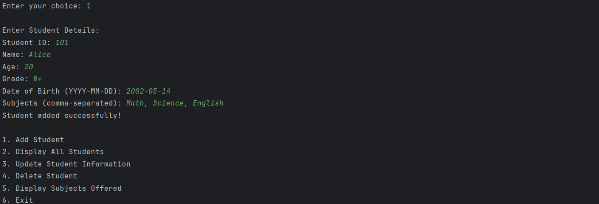
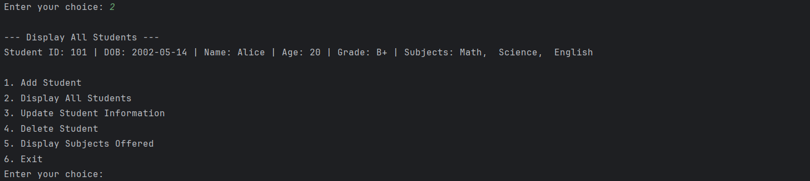

# 🎓 Collection Manipulator – Student Data Organizer

Welcome to **Collection Manipulator**, a Python-based menu-driven application designed to manage student records efficiently using Python Collection Data Types. This project demonstrates the practical implementation of Lists, Dictionaries, Tuples, and Sets while performing basic student record management operations.

---

# 🌟 Project Overview

The Student Data Organizer helps users maintain student information in an organized manner. The application allows users to add, view, update, and delete student records while also displaying all unique subjects offered by students.

This project was developed as part of Python programming practice to strengthen understanding of collection data structures and CRUD operations.

---

# ✨ Features

## ➕ Add Student

Store student information including:

* Student ID
* Name
* Age
* Grade
* Date of Birth
* Subjects

---

## 📋 Display All Students

Displays all student records in a clean and structured format.

Example:

```text
Student ID: 101 | Name: Alice | Age: 20 | Grade: A | Subjects: Math, Science, English
```

---

## ✏️ Update Student Information

Modify existing student records using Student ID.

You can update:

* Age
* Subjects

---

## ❌ Delete Student

Remove a student record permanently using Student ID.

---

## 📚 Display Subjects Offered

Displays all unique subjects available in the system.

Example:

```text
Math
Science
English
Python
```

---

## 🚪 Exit Program

Terminates the application safely.

---

# 🛠️ Technologies Used

* Python 3
* Lists
* Dictionaries
* Tuples
* Sets
* Loops
* Match-Case Statements
* User Input Handling

---

# 📂 Project Structure

```text
Task 3/
│
├── Collection Manipulator.py
├── README.md
│
└── OUTPUT/
    ├── Output_3.png
    └── Output_3-1.png
```

---

# 🗂️ Data Structures Used

## 📌 List

Stores all student records.

```python
students = []
```

---

## 📌 Dictionary

Stores individual student information.

```python
student = {
    "name": "Alice",
    "age": 20,
    "grade": "A"
}
```

---

## 📌 Tuple

Stores Student ID and Date of Birth.

```python
details = (101, "2005-01-15")
```

---

## 📌 Set

Stores unique subjects.

```python
subjects = {"Math", "Science", "English"}
```

---

# 📸 Output Screenshots

## ➕ Adding Student Details




---

## 📋 Displaying Student Records



---

## Project Demo Video

[Click here to watch the demo video](https://drive.google.com/file/d/1SpCI2-byraOqJixKN6CYE83Qb1wpLbMQ/view?usp=sharing)

### Video Demonstrates

✅ Adding Student Records

✅ Displaying Student Records

✅ Updating Student Information

✅ Deleting Student Records

✅ Displaying Subjects Offered

✅ Exiting the Program

---

# ▶️ How to Run

### Step 1: Clone the Repository

```bash
git clone https://github.com/rishitrajput2007/Collection-Manipulator.git
```

### Step 2: Open the Project

Open the project using:

* VS Code
* PyCharm
* IDLE
* Any Python IDE

### Step 3: Run the Program

```bash
python "Collection Manipulator.py"
```

---

# 📋 Program Menu

```text
1. Add Student
2. Display All Students
3. Update Student Information
4. Delete Student
5. Display Subjects Offered
6. Exit
```

---

# 🔄 Program Workflow

```text
Start
  │
  ▼
Display Menu
  │
  ▼
User Selects Option
  │
  ├── Add Student
  ├── Display Students
  ├── Update Student
  ├── Delete Student
  ├── Display Subjects
  └── Exit
  │
  ▼
Return to Menu
  │
  ▼
End
```

---

# 🧠 Concepts Practiced

* Lists
* Dictionaries
* Tuples
* Sets
* CRUD Operations
* Searching Records
* Updating Records
* Deleting Records
* String Manipulation
* Menu-Driven Programming

---

# 🎯 Learning Outcomes

Through this project, the following concepts were strengthened:

✅ Collection Data Structures

✅ Data Organization Techniques

✅ CRUD Operations

✅ Python Programming Fundamentals

✅ Logical Thinking and Problem Solving

---

# 🚀 Future Enhancements

* File Handling Support
* Student Search Feature
* Sorting Records
* GUI Version using Tkinter
* Database Integration
* CSV Export Functionality

---

# 👨‍💻 Author

## Rishit Rajput

GitHub:
https://github.com/rishitrajput2007

---

# ⭐ Thank You

Thank you for visiting this repository.

If you found this project useful, consider giving it a ⭐ on GitHub.
